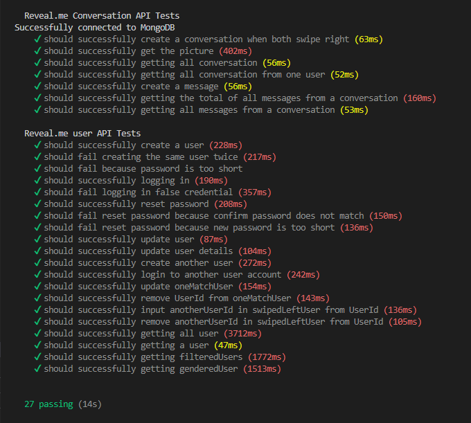
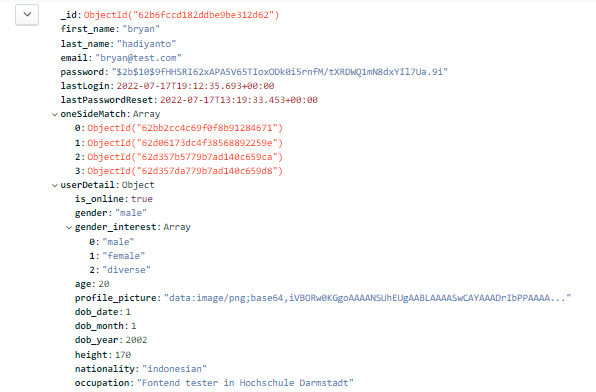

# Reveal.me
reveal you, reveal us!

A full stack web dating application for discovering genuine connections ! Get matched with strangers with the same
interest and build your connection through chatting which will slowly reveal the picture of your new date!

### Dependencies

Database:

- MongoDB

Backend :

- Typescript
- Express JS
- Nodemon
- CORS
- Body parser
- Bcrypt
- Socket.io
- Jsonwebtoken
- dotenv
- jimp
- Mocha
- Chai
- Supertest

Frontend :

- Vite
- React
- React-dom
- React-router
- Axios
- TailwindUI
- DaisyUI
- Socket.io
- Cypress

## Getting Started

### Setup scripts

Scripts:

- Backend : start_backend.sh
- Frontend : start_frontend.sh
- Realtime chatting: start_realtime_chat.sh
- Backend test : backend_test.sh
- Frontend test: frontend_test.sh
- Frontend test with Cypress GUI: frontend_test_gui.sh

### Starting the application

- To start reveal.me, simply run the start_backend.sh and start_frontend.sh scripts
- Optionally, realtime chatting can be started with start_realtime.sh
- To visit the website, enter this url: http://localhost:3000 and  will direct you to the landing page, to login or register a user
- To run the automatic tests:
- Run the respective test scripts for frontend and backend. - **(Make sure that both start scripts are running first!)**
- A postman collection can be used for testing the individual api calls

## Testing

Frontend:

- Automated testing for frontend is done using Cypress. Each page is tested automatically to cover all functionality.

- Network requests to servers are intercepted using Mock service worker and return predefined data

Backend:

- Automatic testing is done using Mocha, Supertest, and Chai.
- Tests are shown in the picture below
  

## Functionality
- Landing Page

    - in this page the user can select whether to Sign in or create a new account
- Register Page

    - user can create a new account here
- Login Page

- Forgot Password Page

- Create Profile Page

- Homepage 

    - In this page the user can swipe potential matches.
    - The matching algorithm uses the shared interest to match users.
- Messages Page
  
    - In this page the user can message with all of their matches. After a certain amount of chats from both users, the
  profile picture of the chat partner will be unblurred
- Explore Users Page
  
    - In this page the user can find other users by hobbies and match with them

## REST API ROUTES

For a more detailed documentation see in **_[openApi]_** file

Base URL for API : http://localhost:5000

[openApi]: https://code.fbi.h-da.de/stdwrahm/reveal.me/-/blob/main/Backend/reveal.me/openApi/openapi.yaml#/

### Database

stored into 3 collection:

#### user collection
Information of user are stored in this collection.

userDetail contain information for user Profile and matching (gender interest and hobbies)

#### conversation collection
Information of 2 match users are stored in this collection

#### message collection
Information of each member chats in a conversation are stored in this collection

## Authors

Aris Ananta Muljono |

Bryan Hadiyanto | bryan.hadiyanto@stud.h-da.de

Dwiresti Puspita Rahmi | dwiresti.p.rahmi@stud.h-da.de

Enrico Egen Selian | Enrico.E.Selian@stud.h-da.de

